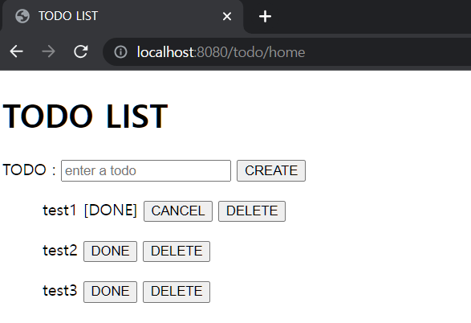

<h1> :cloud: SIMPLE TODO LIST :cloud: </h1>

<br>

<h2> 프로젝트 소개</h2>

---
**이 프로젝트는 간단한 투두리스트 프로그램을 구현한 것입니다.** 

사용자는 시작 화면에서 로그인과 회원가입을 할 수 있습니다. 

회원가입 시 이미 등록된 아이디는 사용할 수 없습니다. 회원가입 화면에서 아이디와 비밀번호, 이메일을 입력합니다. 

회원가입 후 로그인 화면으로 이동합니다. 로그인 한 사용자는 아래의 기능들을 이용할 수 있습니다.
* 할 일 등록
* 할 일 완료/취소 
* 할 일 내용 수정
* 할 일 삭제

<br>

미리 등록된 관리자 계정은 아래와 같습니다.
* 아이디: admin 
* 비밀번호: password

<br>

<h2> 시작 가이드 </h2>

---
<h3>요구사항</h3>
이 프로그램을 로컬 환경에서 실행하려면 아래의 도구들이 필요합니다.
* [Java 17] (https://www.oracle.com/java/technologies/downloads/#jdk17-linux)
* [H2 Database 2.1.214] (http://www.h2database.com/html/download.html)

<br>

<h3>설치</h3>
```bash
$ git clone https://github.com/jaamong/SpringBoot_Simple_TodoList.git
```
<br>

<h3>실행</h3>
 프로그램을 로컬 환경에서 실행하는 방법입니다.
1. 터미널 창을 열고 프로젝트를 클론받은 위치로 이동합니다.
2. 터미널에 아래 명령어를 입력하여 프로젝트를 빌드합니다.
    ```bash
    $ ./gradlew clean build -x test
    ```
3. 터미널에 아래 명령어를 입력하여 `.jar` 파일이 있는 곳으로 이동합니다.
    ```bash
    $ cd build/libs
    ```
4. 터미널에 아래 명령어를 입력하여 프로젝트를 실행합니다.
    ```bash
   $ java -jar todo-0.0.1-SNAPSHOT-plain.jar
    ```
5. 브라우저에 `localhost:8080/todo-list`을 입력하여 프로그램을 이용합니다.

<br><br>

<h2>기술 스택 :hammer:</h2>

---
<h3>Environment</h3>


<br>

<h3>Development</h3>


<br><br>

<h2>프로젝트 구조(업데이트 예정)</h2>

---


<br><br>

<h2>회고</h2> 

---

<h3>:hatching_chick: 새로운 시도 - JavaScript</h3>

자바 스크립트는 이번 프로젝트를 통해 처음 사용하게 되었다. 프로젝트 초기에는 `Thymeleaf`로 `view`를 간단히 끝냈는데, 토큰을 활용한 로그인을 도입하면서 `"토큰을 어떻게 주고받을 수 있을까?"`를 고민하다보니 자바 스크립트를 도입하게 되었다. 
처음 사용하다보니 많이 헤맸지만, 적용한 결과를 보면서 뿌듯했다. 

<br>

<h3>:triangular_flag_on_post: 해결하지 못한 문제</h3>

<br>

***:one: Spring Security와 로그인 화면***

                                "JWT 값을 view에서 controller로 어떻게 전달할 수 있을까?"


`Spring Security`와 `JWT`를 도입하면서 가장 많이 고민하고 지금까지도 고민하는 부분이다.
`JWT`를 도입하면 토큰으로 사용자 정보를 조회할 수 있기 때문에 클라이언트로부터 사용자를 식별할 값을 따로 받지 않아도 된다. REST API라면 단순히 컨트롤러에서 `Authentication`(Spring Security에 속한 인터페이스)를 파라미터로 받아서 사용자 정보를 가져올 수 있다. <br>

나의 문제는 `Spring Security`에서 제공하는 `formLogin`을 사용하지 않고 별도로 로그인 화면을 구성하는 것에서 시작했다.<br>
프로그램이 실행되고 사용자가 요청을 보내면 `JwtTokenFilter`에서 요청 헤더에 담긴 토큰(Authorization)이 유효한지 확인한다. 토큰이 유효하면 `SecurityContext`에 사용자 정보를 담는다. 
이렇게 담긴 사용자 정보는 이후 실행되는 `AuthorizationFilter`에 전달되고, `SecurityContext`에 계속 사용자 정보가 남게 된다. 
하지만 먼저 언급했던 것처럼 본 프로젝트는 `formLogin`를 사용하지 않았기 때문에 토큰을 담아 요청을 하더라도 `SecurityContext`에 사용자의 정보가 유지되지 않는다. <br>

기존에는 사용자를 식별하기 위해 DB의 PK 값을 `path variable`로 받았다(인가를 위해 header에 담긴 토큰도 받음). 
그러다가 문득 `JWT`를 따로 받는데 추가적인 사용자 식별 정보를 받을 필요가 없다는 것을 깨닫고 `formLogin`을 사용하도록 코드를 수정하려 했다. 처참하게 실패했다.<br>

이유는 프로젝트 설계 단계에서 해당 부분을 고려하지 못했기 때문이다. 고려했다면 엔드포인트와 화면 구성 등을 지금처럼 설계하지 않았을 것이다.
덕분에 다음 프로젝트에서는 `Spring Security`와 `view`와의 관계를 더 고려하고 설계해야 겠다는 교훈을 얻었다.


<br>

***:two: Spring Security와 static resources***

                        "Spring Security에서 하라는 대로 permitAll()을 했는데 왜 css는 계속 403?"

`css`나 `js`와 같은 정적 리소스 파일들은 인증된 사용자가 아니어도 접근이 가능해야 했다. 
사용자가 실제로 실행되길 원하는 기능은 `html`이나 `js` 파일을 통해 엔드포인트로 요청을 보내기 때문에 굳이 인증할 필요가 없기 때문이다. 하지만 아래와 같이 `configuration`을 작성해도 `403(Unauthorize)`만 나를 반겨주었다.

```java
    @Bean
    public SecurityFilterChain securityFilterChain(HttpSecurity http) throws Exception {
        return http
        .csrf(AbstractHttpConfigurer::disable)
        .authorizeHttpRequests(auth -> auth
        .requestMatchers("...").permitAll()
        .requestMatchers(PathRequest.toStaticResources().atCommonLocations()).permitAll() //정적 리소스 접근 허용
        .anyRequest().authenticated()
        )
        .addFilterBefore(jwtTokenFilter, AuthorizationFilter.class)
        .sessionManagement(session -> session.sessionCreationPolicy(SessionCreationPolicy.STATELESS))
        .build();
        }
```
<br>

그래서 아래처럼 다른 방식으로 작성도 해보았지만 여전히 `403` 에러만 발생했다. (이 방식은 필터를 아예 적용하지 않기 때문에 Spring Security에서 권장하지 않는다)  

```java
    @Bean
    public WebSecurityCustomizer webSecurityCustom() throws Exception {
        return webSecurity -> webSecurity
                .ignoring()
                .requestMatchers("/static/**");
    }
```

<br>

결국 아래처럼 작성하게 되어 더는 secure가 쓸모 없었다. 
그래도 일단 `Spring Security`를 사용했다는 흔적을 남기고 싶어서 아래처럼 코드를 유지중이다.

```java
    @Bean
    public WebSecurityCustomizer webSecurityCustom() throws Exception {
        return webSecurity -> webSecurity
                .ignoring()
                .requestMatchers("/static/**")
                .anyRequest();
        }
```
<br>

원인은 마찬가지로 `formLogin` 때문인 것으로 추측하고 있다(이 부분은 찾아도 나오지가 않는다). `formLogin`을 잠깐이나마 적용하면서 혹시나 하는 마음으로 `anyRequest()` 부분을 제거하니 제대로 동작했다. 
하지만 이 프로젝트는 설계 오류로 적용할 수 없기 때문에 모든 요청을 허용해주는 상태로 유지하게 되었다. `Spring Security`를 적용한 의미가 없어졌다 :cry:. <br>


<br>

***:three: QueryDSL 도전기***

`TodoService`의 `getTodoById()`의 코드를 `QueryDSL`을 활용하여 코드를 줄이고 싶었다. `getTodoById()`의 흐름은 아래와 같다.
1. `TodoRepository`의 `findAllByUserId(Long userId)`는 파라미터 `userId`와 일치하는 `List<Todo>`를 반환한다.   
2. 1번의 값을 받은 `getTodoById()`에서 파라미터 `todoId`와 일치하는 `Todo`를 반환한다. 

이 과정을 SQL로 정리하면 아래와 같다.
```sql
select * from (select * from todo where todo.user.id = userId) where todo.id = todoId
```

<br>

문제점은 `QueryDSL`이 위와 같은 `from` 절의 `서브쿼리`를 지원하지 않는다는 것이다. 
어떻게 `JOIN`으로 해결할 수 없을까 하고 열심히 알아봤지만, `서브쿼리`와 `JOIN`이 상호 변환될 수 있는 조건에 맞지 않는 듯 했다. 
쿼리를 나눠서라도 적용해보고 싶었으나 `QueryDSL`을 자세히 알지 못한 상태에서 시도하다가 실패로 끝났다. <br>

다른 방법을 제쳐두고 해당 기술을 시도한 이유는 현재 코드와 비교했을 때 성능 향상이 얼마나 되는지 확인하고 싶었기 때문이다.
사실 투두리스트라는 프로젝트의 특성을 생각해보면 사용자가 성능 이슈를 일으킬 만큼의 할 일을 등록하는 일은 매우 드물기 때문에, 현재 코드로도 성능에 큰 문제는 없다. 그래도 여전히 아쉽다.


<br><br>

<h2>실행 화면 (업데이트 예정)</h2>

---



<br><br>

<h2>Need To Fix/Update</h2>

---
<h3>Front</h3>
:one: 회원가입 시 비밀번호의 길이가 7자리 이하면 사용자에게 비밀번호는 반드시 8자리 이상이어야 한다고 안내해야 한다.
* `register.js`에서 `else if`로 길이를 확인하고 있으나 실제로는 기능하지 않음. 

:two: 사용자의 입력 오류로 인해 백엔드에서 런타임 에러가 발생하면 프론트에서 잡아서 사용자에게 안내해야 한다.
* 회원가입 시 이미 등록된 아이디를 입력했을 경우 (완료)
* 로그인 시 잘못된 아이디/비밀번호를 입력했을 경우
* 투두를 등록하는 사용자가 조회했을 때 존재하지 않는 사용자인 경우

:three: bootstrap 적용 또는 css 수정


 


